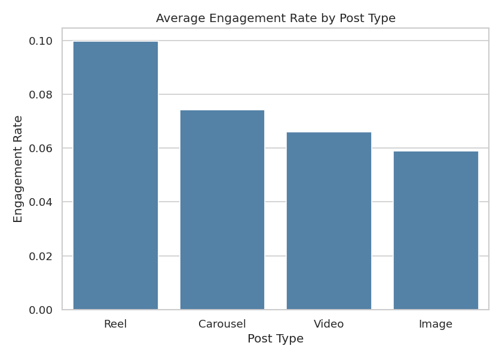
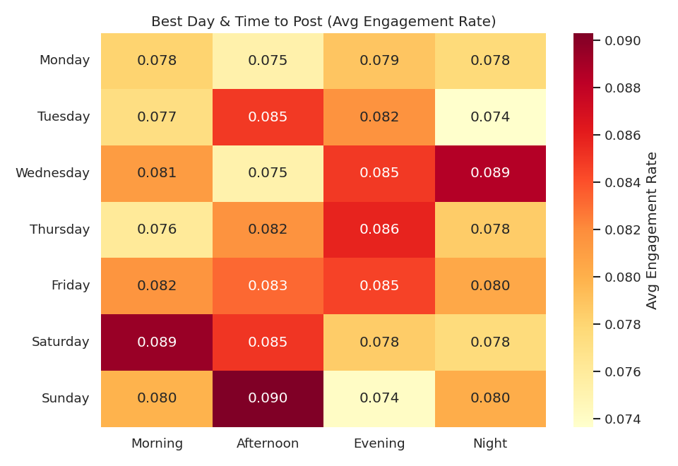
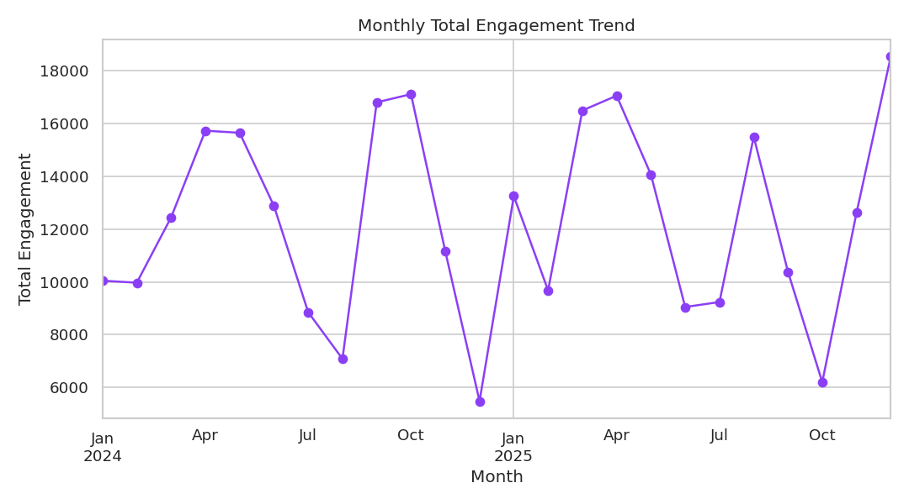

# Instagram Engagement & Growth Analytics

End-to-end analysis of Instagram post performance — from raw data to
actionable content strategy — built with Python, MySQL, Excel, Power BI,
and Tableau.


## Problem Statement

Social media managers post content without a data-backed view of what
actually drives reach and engagement. This project analyzes 600+ Instagram
posts to answer five business questions and turn them into a concrete
posting strategy:

1. Which post format (Reel / Carousel / Image / Video) drives the highest engagement?
2. What day and time should content go live?
3. Does hashtag usage meaningfully affect reach?
4. How has engagement trended over the last two years?
5. Which posts are top vs. bottom performers, and what do they have in common?

## Dataset

A 620-row post-performance dataset (`data/raw/instagram_posts_raw.csv`)
covering Jan 2024 – Dec 2025, with per-post reach, impressions, likes,
comments, shares, saves, hashtags, and captions.

> **Note on data source:** Instagram's official Graph API restricts bulk
> historical exports to the account owner, and public datasets are often
> stale or inconsistently labeled. To keep this pipeline fully reproducible,
> the dataset was generated with `scripts/00_generate_dataset.py` using
> distributions informed by publicly reported engagement benchmarks
> (Reels outperforming static images, log-normal reach distribution, etc.).
> The entire cleaning → analysis → BI pipeline below is written to work
> unchanged against a real Instagram Insights export — swap the file in
> `data/raw/` and rerun.

## Tech Stack

| Stage | Tools |
|---|---|
| Data generation / cleaning | Python, Pandas, NumPy |
| Exploratory analysis | Matplotlib, Seaborn |
| Database & queries | MySQL |
| Reporting workbook | Excel (formula-driven, openpyxl) |
| Dashboards | Power BI, Tableau |

## Project Structure

```
instagram-analytics-project/
├── data/
│   ├── raw/instagram_posts_raw.csv          # generated raw export
│   └── processed/instagram_posts_clean.csv  # cleaned, feature-engineered
├── scripts/
│   ├── 00_generate_dataset.py
│   ├── 01_data_cleaning.py
│   ├── 02_eda_visualization.py
│   └── 03_build_excel_workbook.py
├── sql/
│   ├── 01_create_schema.sql                 # MySQL table + load
│   └── 02_analysis_queries.sql              # business-insight queries
├── excel/
│   └── instagram_analytics.xlsx             # formula-driven summary workbook
├── visuals/                                 # exported charts (PNG)
├── dashboard/
│   └── dashboard_notes.md                   # Power BI / Tableau build guide
├── requirements.txt
└── README.md
```

## How to Run

```bash
git clone https://github.com/<your-username>/instagram-analytics-project.git
cd instagram-analytics-project
pip install -r requirements.txt

python scripts/00_generate_dataset.py       # creates data/raw/
python scripts/01_data_cleaning.py          # creates data/processed/
python scripts/02_eda_visualization.py      # creates visuals/
python scripts/03_build_excel_workbook.py   # creates excel/
```

For MySQL: run `sql/01_create_schema.sql` then `sql/02_analysis_queries.sql`
in MySQL Workbench (or CLI) with `data/processed/instagram_posts_clean.csv`
as the source file.

For Power BI / Tableau: import `data/processed/instagram_posts_clean.csv`
and follow `dashboard/dashboard_notes.md` for the exact fields, calculated
measures, and chart layout used.

## Key Findings

**1. Reels dominate engagement.** Reels averaged a **9.97% engagement rate**,
roughly 70% higher than static Images (5.9%) and well ahead of Carousels
(7.4%) and Videos (6.6%).



**2. Weekend afternoons/evenings and Wednesday night perform best.** The
day × time-of-day heatmap shows Saturday morning, Sunday afternoon, and
Wednesday night as consistent engagement peaks — a useful starting point
for a posting schedule, to be refined with more data.



**3. Hashtag count has a weak effect on reach** (correlation ≈ 0.07 in this
dataset) — content format and posting time matter far more than stacking
hashtags.

**4. Engagement is trending upward year over year**, with visible seasonal
dips — useful for setting realistic monthly targets.



**5. Top-performing posts skew heavily toward Reels posted in the evening**,
reinforcing findings #1 and #2 rather than surfacing a separate pattern.

## Recommendations

- Shift content mix toward **Reels** — they consistently outperform every
  other format in this dataset.
- Concentrate publishing around **weekend afternoons and Wednesday evenings**
  rather than spreading posts evenly across the week.
- Stop over-optimizing hashtag count; invest that effort in format and
  timing instead.
- Track engagement rate (not just raw likes) as the primary KPI, since it
  normalizes for reach and gives a fairer month-to-month comparison.

## Limitations

- Dataset is synthetic and does not capture real audience-specific behavior
  — treat findings as a methodology demonstration, not production guidance.
- No control for external factors (paid promotion, algorithm changes,
  follower count growth over the period).
- Correlation ≠ causation: the hashtag/timing findings are associative.

## Author

Built as a data analyst portfolio project to demonstrate an end-to-end
workflow: data generation/cleaning (Python) → analysis (Pandas/Seaborn) →
storage & querying (MySQL) → reporting (Excel) → visualization (Power BI,
Tableau).


## Run the project

From the project root:

```bash
pip install -r requirements.txt
python scripts/00_generate_dataset.py
python scripts/01_data_cleaning.py
python scripts/02_eda_visualization.py
python scripts/03_build_excel_workbook.py
```

The generated/updated outputs are stored in `data/`, `visuals/`, and `excel/`.

### Project structure

- `data/raw/` — raw Instagram posts dataset
- `data/processed/` — cleaned dataset
- `scripts/` — Python data pipeline and visualization scripts
- `sql/` — database schema and analysis queries
- `excel/` — Excel analytics workbook
- `visuals/` — generated charts
- `dashboard/` — dashboard documentation
